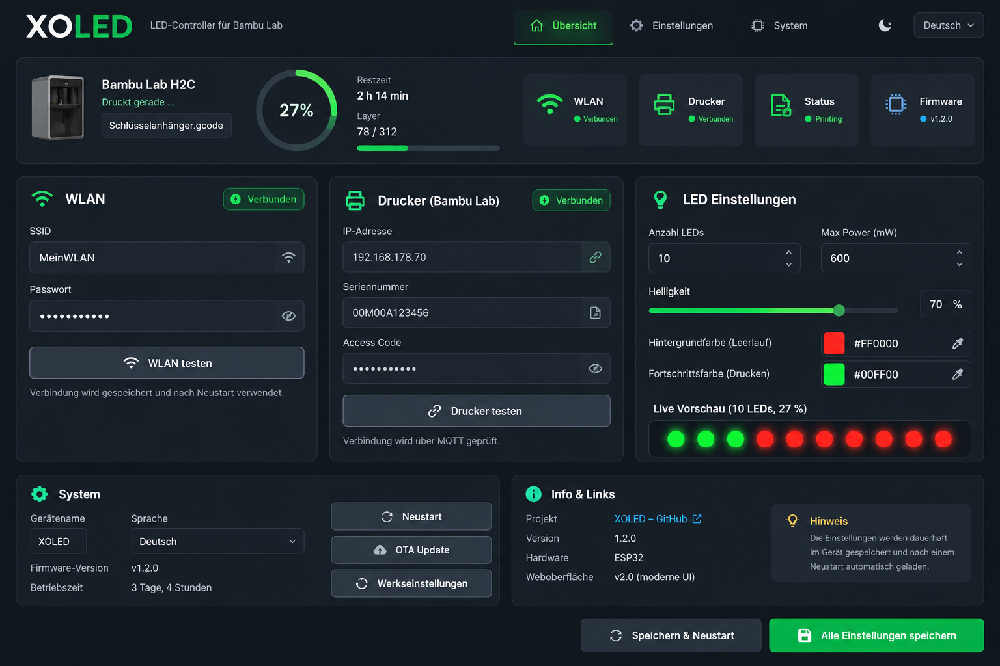

# XOLED

XOLED turns an ESP32 and an addressable LED strip into a live status display for Bambu Lab printers. It reads printer data via MQTT and shows connection state, print progress and current job status directly on the LEDs.



## Highlights

- Modern local web interface for WiFi, printer and LED configuration
- Bambu Lab MQTT connection, including H2-series print status handling
- Live LED preview, adjustable LED count, brightness, power limit and colors
- Visual boot animation, LED color test and printer connection test
- OTA firmware update from the browser
- Password-free `XOLED-Setup` access point for first-time setup
- Web installer for ESP32 from Chrome or Edge

## Install

Open the [XOLED Web Installer](https://d3nn3s08.github.io/XOLED/) in Chrome or Edge on a desktop computer. Connect the ESP32 with a USB data cable, click **Connect**, select its serial port, and follow the installation prompt.

After flashing, the ESP32 creates the open WiFi network **XOLED-Setup** when no WiFi has been configured. Connect to it and open [http://192.168.4.1](http://192.168.4.1) to complete setup.

> The setup access point is intentionally open so a fresh device can be configured without a password. Configure your own WiFi immediately afterwards.

## Configure XOLED

1. Open the device page after setup.
2. Connect XOLED to your WiFi.
3. Enter the printer IP address, serial number and access code.
4. Use **Drucker testen** to verify the MQTT connection.
5. Set LED count, brightness, power limit and the idle/printing colors.
6. Save the settings. They remain stored on the ESP32.

## Hardware

- ESP32 development board
- WS2812B-compatible addressable LED strip
- Stable 5 V power supply sized for the LED strip
- USB data cable for the first installation

The default data pin is defined in [`src/const.h`](src/const.h).

## Development

The project uses PlatformIO.

```text
platformio run
platformio run -t upload
platformio run -t uploadfs
```

The web installer files and firmware manifest are located in [`docs/`](docs/). GitHub Pages publishes that directory.

## Project status

XOLED is actively developed. The current firmware includes the new web interface, persistent settings, OTA updates and current Bambu Lab MQTT status parsing. Further printer-model validation is welcome.

## Credits and license

XOLED is a fork of [michaelowens/XOLED](https://github.com/michaelowens/XOLED). The enclosure design is by [ortoPilot](https://makerworld.com/en/models/570064#profileId-489970). This project is licensed under the [MIT License](LICENSE).
